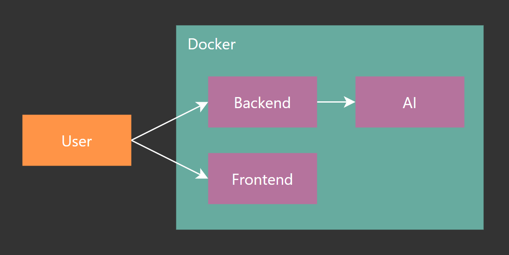

<h1 align="center">
   
  Momentum Documentation
</h1>

## About

Momentum is a WebApp designed to help hemophiliacs to exercise and thus counteract the progression of the disease.
By assigning a plan of exercises to a patient, the patient can execute these exercises while being supervised by an AI running on the backend. This way, the patient can be sure that the exercises are being executed correctly.

  
  

## Running the app

To run Momentum, you need at least the frontend, the backend and an AI server.
All are distributed as Docker images.

  

As you can see in this image, Frontend and Backend need to be publicly accessible. The AI server needs to be accessed only from the backend.

For deployment environments, we strongly recommend an external PostgreSQL database to be used with the backend.

In the folder [`compose`](compose) you can find some example configurations.

## Caveats

### Webcam Access

When training, the frontend needs access to a webcam in the clients browser.
Due to security reasons, a webcam can only be accessed if the client connects to the server via `localhost` or if the connection is SSL encrypted.

## Contributing

Contributions are welcome!
To contribute, please open a pull request on one of the following repositories:

- [Frontend](https://github.com/bp-momentum/frontend)
- [Backend](https://github.com/bp-momentum/backend)
- [AI Server](https://github.com/bp-momentum/ai)

If possible, please follow the [contribution guidelines](.github/CONTRIBUTING.md).