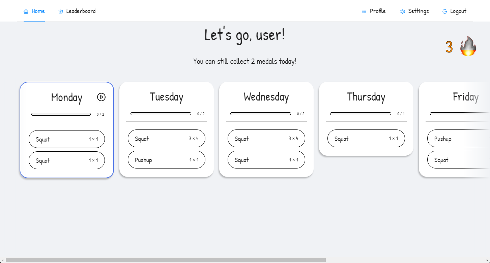
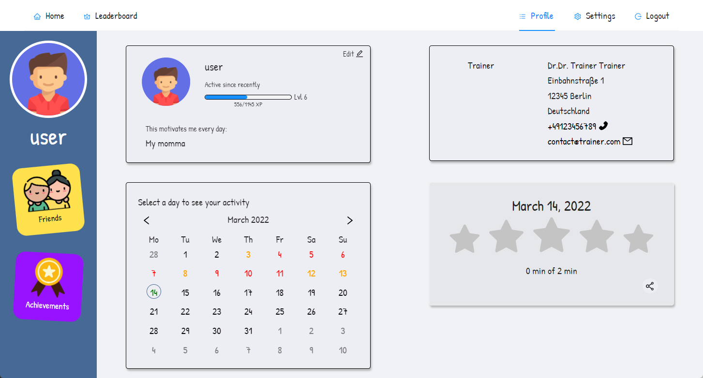

<h1 align="center">
  <br>
  Momentum
</h1>

This is the official documentation for the Momentum Web App.

## About

Momentum is a WebApp designed to help hemophiliacs to exercise and thus counteract the progression of the disease.
By assigning a plan of exercises to a patient, the patient can execute these exercises while being supervised by an AI running on the backend. This way, the patient can be sure that the exercises are being executed correctly.

<div align="center">
  
  
</div>

## Running the app

To run Momentum, you need at least the frontend and the backend.
Both are distributed as Docker images.

For deployment environments, we strongly recommend an external PostgreSQL database to be used with the backend.

In the folder [`compose`]() you can find some example configurations.

## Example Test Environment

```yml
version: '3.1'

services:
  momentum-backend:
    image: ghcr.io/bp-momentum/backend:latest
    restart: unless-stopped
    ports:
      - 8000:8000
    environment:
      EMAIL_ADDRESS: test@example.com
      EMAIL_PASSWORD: test
      EMAIL_HOST: smtp.example.com
      DATABASE_USE_POSTGRESQL: "false"
      VIDEO_PATH: videos
      ALLOWED_ORIGINS: http://localhost
      ALLOWED_HOSTS: 127.0.0.1,localhost
      WEBSITE_URL: localhost:8080

  momentum-frontend:
    image: ghcr.io/bp-momentum/frontend:latest
    restart: unless-stopped
    ports:
      - 443:443  # this needs to be https for camera access
    depends_on:
      - momentum-backend
    environment:
      # TODO
```